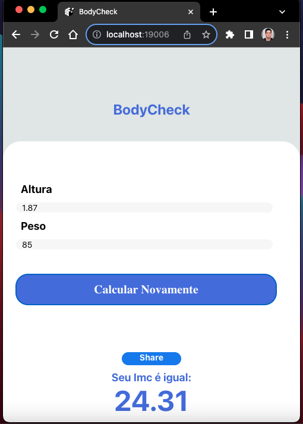

# BodyCheck - Calculadora de IMC

BodyCheck é um aplicativo desenvolvido em React Native utilizando Expo, projetado para calcular o Índice de Massa Corporal (IMC) de forma simples e eficiente.

![Body Check App]

## Funcionalidades

- **Cálculo de IMC:** Determine seu Índice de Massa Corporal inserindo sua altura e peso.
- **Avaliação de Saúde:** Receba uma avaliação de saúde com base no seu IMC calculado.

## Tecnologias Utilizadas

- **React Native:** Utilizado para o desenvolvimento da interface do usuário.
- **Expo:** Facilita o processo de criação e teste do aplicativo.
- **React Native Components:** Implementação de três componentes essenciais para a estrutura do aplicativo.

## Como Usar

Para utilizar o aplicativo BodyCheck:

1. Certifique-se de ter o Expo instalado no seu dispositivo móvel.
2. Clone este repositório: `git clone https://github.com/seu-usuario/BodyCheck.git`
3. Navegue até o diretório do projeto: `cd BodyCheck`
4. Instale as dependências: `npm install` ou `yarn install`
5. Inicie o aplicativo: `expo start`

Isso abrirá o Expo Developer Tools no seu navegador. Use o seu dispositivo móvel com o aplicativo Expo instalado para escanear o código QR e abrir o aplicativo BodyCheck.

## Estrutura do Projeto

O projeto está estruturado da seguinte forma:

- **`/src`**: Contém os componentes e arquivos relacionados à lógica do aplicativo.
  - **`/src/components`**: Componentes essenciais para a interface do usuário.

## Contribuindo

Contribuições são bem-vindas! Sinta-se à vontade para abrir uma issue ou enviar um pull request.

## Autor

[Luis Renan Pavanello](https://github.com/luisrpavanelli)

## Licença

Este projeto está licenciado sob a [Licença MIT](https://opensource.org/licenses/MIT).
